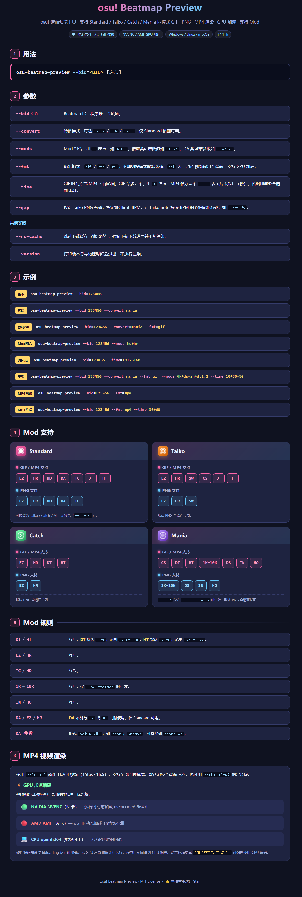
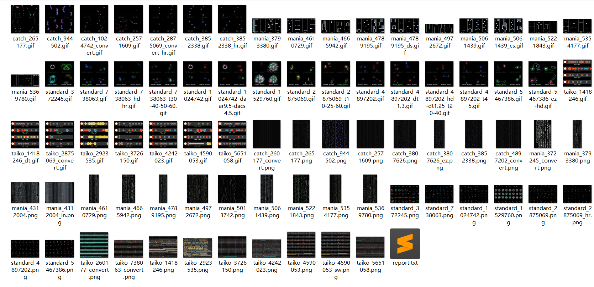

# osu! Beatmap Preview

> 一个快速的 osu! 谱面预览工具，支持四种模式（Standard / Taiko / Catch / Mania）的 GIF 动图与 PNG 静态图渲染。

## 特性

- **单可执行文件**：皮肤资源在编译期嵌入二进制，无运行时依赖。
- **跨平台**：Windows / Linux / macOS。
- **四模式支持**：`standard`、`taiko`、`catch`、`mania`。
- **转谱**：Standard 可转为 Taiko / Catch / Mania 并预览。
- **丰富的 Mod**：`EZ` `HR` `HD` `DA` `DT` `HT` `SW` `CS` `1K`–`10K` `DS` `IN` `HO`。
- **GIF + PNG**：GIF 支持自定义时间点，PNG 输出全谱面长图。
- **高性能**：渲染速度快、内存占用低、输出文件体积小。详见 [批量渲染报告](docs/report.txt)。

> 如果这个项目对你有帮助，欢迎点个 ⭐ Star 支持一下～

## 使用



## 输出

程序向 stdout 输出 JSON，schema 如下：

```json
{
  "status": "ok",
  "msg": "...",
  "preview-img": ["/path/to/output.gif"],
  "beatmap-info": {
    "title": "...",
    "artist": "...",
    "creator": "...",
    "version": "...",
    "mode": "..."
  },
  "build-info": {
    "version": "1.0.2",
    "build_time": "2026-06-21T00:00:00.000000000+08:00"
  }
}
```

| 路径 | 说明 |
| --- | --- |
| 谱面缓存 | `<临时目录>/osu-beatmap-preview/osu-download-cache/<bid>.osu` |
| 输出文件 | `<临时目录>/osu-beatmap-preview/outputs/<mode>_<bid>[_convert][_mods][_t<时间点>][_bpm<BPM值>].<fmt>` |
| 批量脚本 | `batch_render.ps1` — 可批量渲染多个 bid 并生成对比 HTML |

> 缓存文件不会自动删除，占用过大时可手动清理临时目录。

## 效果预览



> 更多示例见 [docs/preview](docs/preview)。

## 构建

```bash
cargo build --release
# 产物: target/release/osu-beatmap-preview(.exe)
```

> 需要 Rust 1.70+。安装方式：<https://rustup.rs>

## License

[MIT](LICENSE)