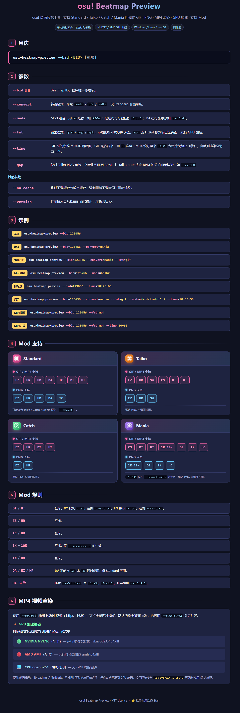

# osu! Beatmap Preview

[中文](README.md) | [English](docs/README.en.md)

> 一个快速的 osu! 谱面预览工具，支持四种模式（Standard / Taiko / Catch / Mania）的 GIF 动图、PNG 静态图与 MP4 视频渲染。

## 特性

- **单可执行文件**：皮肤资源在编译期嵌入二进制，无运行时依赖。
- **跨平台**：Windows / Linux / macOS。
- **四模式支持**：`standard`、`taiko`、`catch`、`mania`。
- **三种输出格式**：`gif` 动图、`png` 静态长图、带谱面原始音频的 `mp4` 视频。
- **GPU 加速视频编码**：Windows 上自动检测 NVIDIA NVENC / AMD AMF 硬件编码器，无 GPU 时回退 CPU（openh264），保持单文件无运行时依赖。Linux / macOS 使用 CPU 编码。
- **转谱**：Standard 可转为 Taiko / Catch / Mania 并预览。
- **丰富的 Mod**：`EZ` `HR` `HD` `DA` `DT` `HT` `SW` `CS` `1K`–`10K` `DS` `IN` `HO`。
- **高性能**：渲染速度快、内存占用低、输出文件体积小。详见 [批量渲染报告](docs/report.txt)。
- **多进程安全日志**：共享写入 `render.log`（NDJSON 汇总，每谱面一行：时间、bid、渲染时长与谱面/环境信息）与 `progress.log`（可 `tail -f` 实时查看的阶段事件流），多进程并发写入同一文件不会交错。

> 如果这个项目对你有帮助，欢迎点个 ⭐ Star 支持一下～

## 使用



## 输出

程序向 stdout 输出 JSON，schema 如下：

```json
{
  "status": "success",
  "msg": "preview generated successfully for bid 738063",
  "preview-img": "/path/to/output.png",
  "beatmap-info": {
    "meta-data": { "title": "...", "artist": "...", ... },
    "difficulty": { ... }
  },
  "build-info": {
    "version": "1.0.3",
    "build_time": "2026-06-22T16:01:06.623636800Z"
  },
  "log": {
    "progress": "C:/Users/.../AppData/Local/Temp/osu-beatmap-preview/logs/progress.log",
    "render": "C:/Users/.../AppData/Local/Temp/osu-beatmap-preview/logs/render.log"
  }
}
```

> `preview-img` 字段为输出文件的绝对路径，格式由 `--fmt` 决定（`.gif` / `.png` / `.mp4`）。
> `log` 字段为可选字段，只有日志启用时才存在，不影响现有解析。
>
> MP4 默认渲染全谱；`--time=t1+t2` 可指定谱面时间范围；`--preview-30s` 会从 `.osu` 的 `PreviewTime` 附近渲染约 30 秒实际播放时长，若尾段不足则自动向前补足。

| 路径 | 说明 |
| --- | --- |
| 谱面缓存 | `<临时目录>/osu-beatmap-preview/osu-download-cache/<bid>.osu` |
| OSZ 缓存 | `<临时目录>/osu-beatmap-preview/osz-download-cache/`（谱包为 `<set-id>.osz`，提取音频按 `<set-id>/<文件名哈希>.<扩展名>` 隔离） |
| 输出文件 | `<临时目录>/osu-beatmap-preview/outputs/<mode>_<bid>[_convert][_mods][_t<时间点>][_preview30s][_bpm<BPM值>].<fmt>` |
| 日志文件 | `<临时目录>/osu-beatmap-preview/logs/` — `progress.log`（实时进度，`tail -f progress.log`）与 `render.log`（NDJSON 汇总） |
| 批量脚本 | `batch_render.ps1` — 可批量渲染多个 bid 并生成对比 HTML |

日志默认开启，可用 `--log-dir=<DIR>` 指定目录、`--no-log` 关闭；也可用环境变量 `OSU_PREVIEW_LOG_DIR` 覆盖目录。日志写入失败只降级到 stderr 提示，不影响渲染与 stdout 结果。

> 缓存文件不会自动删除，占用过大时可手动清理临时目录。输出文件采用原子写入（先写临时文件、完成后才替换），渲染中断不会产生可被当作有效缓存的损坏文件。

## 效果预览


## 构建

```bash
cargo build --release
# 产物: target/release/osu-beatmap-preview(.exe)
```

> MP4 会根据 `.osu` 中的 `AudioFilename` 从 OSZ 提取并同步 MP3、OGG 或 WAV 音频；`AudioLeadIn` 控制全谱视频开始前的静音时长，`--time`、`--preview-30s`、DT 和 HT 同样作用于音轨。`--preview-30s` 的 30 秒指最终 MP4 的实际播放时长，因此 DT/HT 会改变覆盖的谱面时间跨度。

> OSZ 下载、音频解码与 AAC 编码会和画面渲染并行进行，两个任务完成后统一封装为 MP4。

> 需要 Rust 1.73+ 和 C++ 编译器。安装方式：<https://rustup.rs>

## License

[MIT](LICENSE)。内嵌 AAC 编码器使用 Fraunhofer FDK-AAC，许可证不授予专利权，详见 [第三方声明](docs/THIRD_PARTY_NOTICES.md)。
