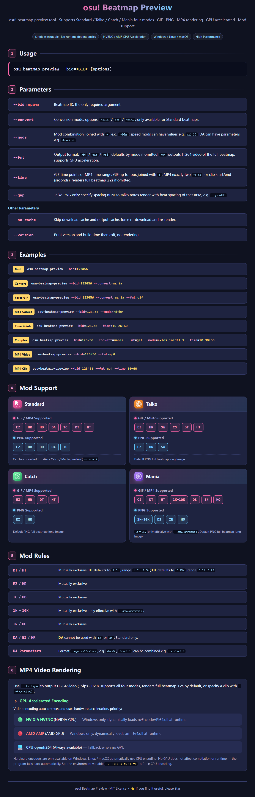

# osu! Beatmap Preview

[中文](../README.md) | [English](README.en.md)

> A fast osu! beatmap preview renderer for GIF animations, PNG images, and MP4 videos across Standard, Taiko, Catch, and Mania.

## Features

- **Single executable**: the default skin is embedded at compile time, with no runtime asset dependency.
- **Cross-platform**: Windows, Linux, and macOS.
- **Four game modes**: `standard`, `taiko`, `catch`, and `mania`.
- **Three output formats**: animated `gif`, static `png`, and `mp4` video with the beatmap's original audio.
- **GPU-accelerated video encoding**: Windows automatically detects NVIDIA NVENC and AMD AMF hardware encoders, then falls back to CPU `openh264`. Linux and macOS use CPU encoding.
- **Beatmap conversion**: Standard maps can be converted to Taiko, Catch, or Mania before previewing.
- **Mod support**: `EZ`, `HR`, `HD`, `DA`, `DT`, `HT`, `SW`, `CS`, `1K`-`10K`, `DS`, `IN`, and `HO`.
- **Efficient rendering**: low memory usage and compact output files. See the [batch rendering report](report.txt).

## Usage



## Output

The program prints a JSON object to stdout:

```json
{
  "status": "success",
  "msg": "preview generated successfully for bid 738063",
  "preview-img": "/path/to/output.png",
  "beatmap-info": {
    "meta-data": { "title": "...", "artist": "..." },
    "difficulty": { }
  },
  "build-info": {
    "version": "1.0.3",
    "build_time": "2026-06-22T16:01:06.623636800Z"
  }
}
```

> `preview-img` is an absolute path. Its extension follows `--fmt`: `.gif`, `.png`, or `.mp4`.

| Location | Description |
| --- | --- |
| Beatmap cache | `<temp>/osu-beatmap-preview/osu-download-cache/<bid>.osu` |
| OSZ cache | `<temp>/osu-beatmap-preview/osz-download-cache/` (archives use `<set-id>.osz`; extracted audio is isolated under `<set-id>/<filename-hash>.<extension>`) |
| Rendered output | `<temp>/osu-beatmap-preview/outputs/<mode>_<bid>[_convert][_mods][_t<time>][_bpm<bpm>].<fmt>` |
| Batch script | `batch_render.ps1`, which renders multiple beatmaps and creates an HTML comparison report |

> Cache files are not deleted automatically. Remove the project directory from your system temporary folder when it is no longer needed.

## Preview


## Build

```bash
cargo build --release
# output: target/release/osu-beatmap-preview(.exe)
```

> MP4 rendering reads `AudioFilename` from the `.osu` file and extracts MP3, OGG, or WAV audio from the OSZ. `AudioLeadIn` controls pre-song silence for full videos, while `--time`, DT, and HT are applied to both tracks.

> OSZ download, audio decoding, and AAC encoding run concurrently with video rendering. The completed tracks are then muxed into the final MP4.

> Rust 1.73 or later and a C++ compiler are required. Install Rust from <https://rustup.rs>.

## License

[MIT](../LICENSE). The embedded AAC encoder uses Fraunhofer FDK-AAC, whose license does not grant patent rights. See [Third-party notices](THIRD_PARTY_NOTICES.md).
