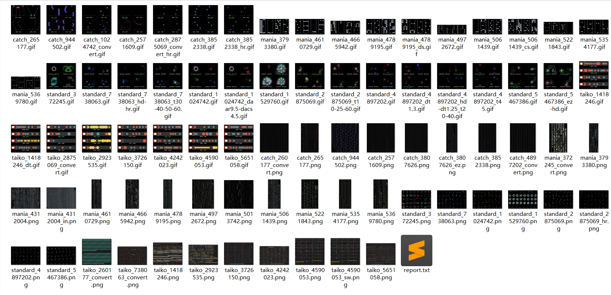

# osu! Beatmap Preview

[Chinese](../README.md) | [English](README.en.md)

A fast, self-contained osu! beatmap preview renderer for Standard, Taiko, Catch, and Mania. It can produce static PNG images, animated GIFs, and MP4 videos with the original beatmap audio.



## Highlights

- **Four game modes**: Supports osu!standard, osu!taiko, osu!catch, and osu!mania.
- **Three output formats**: Generates PNG beatmap overviews, segmented GIF previews, or H.264 MP4 videos with audio.
- **Conversions and Mods**: Converts Standard beatmaps to Taiko, Catch, or Mania and supports common Mod combinations and custom speed multipliers.
- **Single-file distribution**: Skins, fonts, and codecs are built with the application, so normal use does not require additional resource files or FFmpeg.
- **Cross-platform**: Supports Windows, Linux, and macOS. On Windows, the renderer tries NVIDIA NVENC and AMD AMF before falling back to CPU OpenH264. Other platforms use CPU encoding.
- **Cache and configuration isolation**: Caches downloads and rendered output while keeping results from different effective configurations in separate directories.

See the [batch rendering report](report.txt) for performance and resource usage data.

## Download and Run

Download the executable for your platform from [Releases](https://github.com/2710165659/osu-beatmap-preview/releases):

| Platform | Release file |
| --- | --- |
| Windows x64 | `osu-beatmap-preview-windows-amd64.exe` |
| Linux x64 | `osu-beatmap-preview-linux-amd64` |
| macOS Intel | `osu-beatmap-preview-macos-amd64` |
| macOS Apple Silicon | `osu-beatmap-preview-macos-arm64` |

On Linux and macOS, make the downloaded file executable before the first run:

```bash
chmod +x ./osu-beatmap-preview-*
```

Then run it using the downloaded filename, for example:

```bash
# Linux x64
./osu-beatmap-preview-linux-amd64 --bid=738063

# macOS Apple Silicon
./osu-beatmap-preview-macos-arm64 --bid=738063
```

The macOS release files are not signed or notarized by Apple. If macOS blocks the first launch, choose Open Anyway under System Settings > Privacy & Security, or right-click the executable in Finder and choose Open.

You can also [build from source](#build-from-source).

## Quick Start

Only a numeric Beatmap ID is required:

```bash
osu-beatmap-preview --bid=738063
```

The examples below assume the executable has been renamed to `osu-beatmap-preview` and added to `PATH`. When `--fmt` is omitted, Standard defaults to GIF while Taiko, Catch, and Mania default to PNG. On success, the program writes JSON to stdout, and `preview-img` contains the absolute path to the generated file.

### Common Examples

```bash
# Select an output format explicitly
osu-beatmap-preview --bid=738063 --fmt=png

# Convert a Standard beatmap to Mania and render a GIF
osu-beatmap-preview --bid=738063 --convert=mania --fmt=gif

# Apply 4K and 1.25x DT after conversion
osu-beatmap-preview --bid=738063 --convert=mania --mod=4k --mod=dt1.25 --fmt=gif

# Combine multiple Mods; pass each Mod separately
osu-beatmap-preview --bid=738063 --mod=hd --mod=hr

# Render a 30-second MP4 starting at the beatmap PreviewTime
osu-beatmap-preview --bid=738063 --fmt=mp4 --time-points=preview --duration-time=30

# Select four GIF segment start times and render 6 seconds from each point
osu-beatmap-preview --bid=738063 --fmt=gif --time-points=5 --time-points=10 --time-points=15 --time-points=20 --duration-time=6

# Bypass download and output caches, and disable logging
osu-beatmap-preview --bid=738063 --no-cache --no-log
```

In Windows PowerShell, use `.\osu-beatmap-preview-windows-amd64.exe` or the actual renamed filename when the executable is in the current directory.

## Command-Line Options

```text
osu-beatmap-preview --bid=<BID> [--convert=mania|ctb|taiko|standard] [--fmt=png|gif|mp4] [--mod=<MOD>]... [--time-points=<SECONDS|preview>]... [--duration-time=<SECONDS>] [--no-log] [--no-cache] [--config=<PATH|JSON|YAML>]
```

| Option | Description |
| --- | --- |
| `--bid` | Required. A numeric Beatmap ID. |
| `--convert` | Target mode: `mania`, `ctb`, `taiko`, `standard`, or `std`. Only Standard beatmaps can be converted to another mode; selecting the source mode is treated as no conversion. |
| `--fmt` | Output format: `png`, `gif`, or `mp4`. When omitted, Standard uses GIF and the other modes use PNG. |
| `--mod` | One Mod. Repeat the option to combine Mods; values are case-insensitive. |
| `--time-points` | A gameplay time in seconds, or `preview`. Repeat it for GIF or Standard PNG output; MP4 accepts at most one. |
| `--duration-time` | Duration in seconds for each GIF time point or for MP4 output. It must be finite and positive. GIF uses the mode-specific configured segment duration when omitted; MP4 defaults to `600`. |
| `--no-cache` | Bypasses the `.osu`, OSZ, and output caches, forcing a fresh download and render. |
| `--no-log` | Disables file logging. |
| `--config` | A configuration file path or an inline JSON/YAML object. It may be supplied only once. |
| `--version` | Prints the version and build time, then exits. |
| `--help`, `-h` | Prints usage information, then exits. |

### Timeline and Segment Selection

Numeric time points use the gameplay timeline: the first playable object in the target mode after conversion is `0:00`, rather than the absolute audio time shown in the editor.

- GIF and Standard PNG output treat each `--time-points` value as a segment start. If the supplied points do not fill the configured layout capacity, the renderer adds the beatmap `PreviewTime` first and then fills the remaining capacity with deterministic, non-overlapping segments. The same beatmap and configuration produce the same selection.
- The number of time points cannot exceed the configured segment capacity. By default, GIF output has a capacity of 4. Standard PNG has 5 rows by default, so it accepts up to 5 row start times.
- MP4 defaults to a 600-second request starting at gameplay time `0`. Shorter beatmaps use their complete playable range instead of being padded to 600 seconds. A range that extends beyond the end of the beatmap is shifted backward as a unit to preserve its duration.
- MP4 accepts negative start times; portions before the audio begins are silent. `--time-points=preview` uses `PreviewTime` from the `.osu` file and falls back to the first object if that value is missing or invalid.
- `--duration-time` is valid for GIF and MP4. For GIF, each `--time-points` value is rendered for the specified duration. `--time-points` is valid only for GIF, Standard PNG, and MP4.

## Output Formats

### Static PNG

- **Standard**: Produces 5 rows of 8 gameplay snapshots by default. Each row start can be selected with `--time-points`.
- **Taiko**: Arranges the beatmap in play order across multiple rows and draws beat lines, BPM labels, and SV information.
- **Catch**: Arranges the beatmap progression across multiple columns.
- **Mania**: Draws the lane-based beatmap, automatically splits long beatmaps into columns, and shows BPM and SV information.

Layout, colors, spacing, labels, and related settings are configurable.

### Animated GIF

All four modes combine multiple beatmap segments into one animation. The default layout is a `2 x 2` grid for Standard and Catch, 4 rows for Taiko, and 4 columns for Mania. Segment count, segment duration, frame rate, and time labels can be configured independently for each mode.

### MP4 Video

All four modes can produce MP4 videos with the original beatmap audio. MP3, OGG, and WAV sources are supported. By default, the renderer loads the background declared in the OSZ `[Events]` section and darkens it with `BACKGROUND_DIM=0.7`; the background can be disabled in configuration.

On Windows, the renderer automatically selects an available NVENC or AMF hardware encoder and falls back to CPU OpenH264 if needed. Set `OSU_PREVIEW_NO_GPU=1` to force CPU encoding for compatibility checks or performance comparisons.

## Mod Support

| Mode | GIF / MP4 | PNG |
| --- | --- | --- |
| Standard | `EZ` `HR` `HD` `DA` `TC` `DT` `HT` | `EZ` `HR` `HD` `DA` `TC` |
| Taiko | `EZ` `HR` `SW` `CS` `DT` `HT` | `EZ` `HR` `SW` |
| Catch | `EZ` `HR` `DT` `HT` | `EZ` `HR` |
| Mania | `CS` `DT` `HT` `1K`-`10K` `DS` `IN` `HO` | `1K`-`10K` `DS` `IN` `HO` |

The main rules are:

- `DT` and `HT` are mutually exclusive. `DT` defaults to `1.5x` and accepts `1.01` through `2.00`; `HT` defaults to `0.75x` and accepts `0.50` through `0.99`, for example `--mod=dt1.25`.
- `EZ` and `HR`, `TC` and `HD`, and `IN` and `HO` are mutually exclusive pairs.
- `DA` is available only for Standard and cannot be combined with `EZ` or `HR`. Its syntax is `da<parameter><value>`, with `cs`, `ar`, `od`, and `hp` parameters, for example `--mod=dacs5ar9.5`.
- `1K` through `10K` are mutually exclusive. `DS` and key-count Mods change the conversion result only when converting Standard to Mania.
- `DT` and `HT` are not available for PNG. MP4 uses the same Mod support rules as GIF.
- Duplicate Mods and Mods unsupported by the selected mode or format are rejected instead of being silently ignored.

## Configuration

See [assets/default_config.yml](../assets/default_config.yml) for the complete default configuration and field documentation. Custom configuration normally needs to include only the fields being overridden.

Configuration layers are merged recursively in this order:

```text
embedded defaults < config.yml beside the executable < --config
```

Mappings are merged recursively, while arrays and scalar values replace the entire field. Unknown fields, a non-object top level, or values that cannot be converted to the expected type cause startup to fail. Numeric and boolean strings are accepted when they can be converted safely. A missing `config.yml` is ignored, but an existing invalid file is an error.

`--config` accepts a JSON/YAML file path or an inline object:

```bash
# Configuration file
osu-beatmap-preview --bid=738063 --config=C:/path/to/config.yml

# Inline JSON
osu-beatmap-preview --bid=738063 --config='{"layout":{"standard":{"gif":{"ROW_COUNT":1}}}}'

# Inline YAML
osu-beatmap-preview --bid=738063 --config='{layout: {standard: {gif: {ROW_COUNT: 1}}}}'
```

This example disables the MP4 background, changes its dim level, and configures whole-request timeouts for each format:

```yaml
video:
  video:
    ENABLE_BACKGROUND_IMAGE: false
    BACKGROUND_DIM: 0.5
timeouts:
  render:
    PNG_TIMEOUT: 300
    GIF_TIMEOUT: 300
    MP4_TIMEOUT: 900
```

Timeouts are positive integer seconds. They start at the request entry point and cover download, parsing, conversion, cache lookup, rendering, audio processing, encoding, and final output.

### Default Paths

| Content | Default location |
| --- | --- |
| Output files | `<temp>/osu-beatmap-preview/outputs/` |
| `.osu` cache | `<temp>/osu-beatmap-preview/osu-download-cache/<bid>.osu` |
| OSZ and audio cache | `<temp>/osu-beatmap-preview/osz-download-cache/` |
| osu.direct preferred-IP cache | `<temp>/osu-beatmap-preview/osz-download-cache/osu-direct-preferred-ip.json` |
| Automatic configuration file | `<directory containing the executable>/config.yml` |
| Logs | `<temp>/osu-beatmap-preview/logs/` |

These locations are controlled by `paths` in the default configuration. `%TEMP%` expands to the system temporary directory on every platform. `CONFIG_DIR` is resolved separately: a relative path is always based on the directory containing the executable, regardless of the process working directory.

Output produced with the default configuration is written directly to `OUTPUT_DIR`. When the final effective configuration differs from the defaults, the renderer computes a stable six-character hash of the differences and uses `OUTPUT_DIR/<config-hash>/` instead. That directory also receives a `config.yml` containing only non-default fields. Equivalent configurations therefore share the same output cache.

## Program Output, Caches, and Logs

### stdout JSON

After command-line parsing succeeds, success and error results from configuration, download, parsing, validation, and rendering are written as JSON to stdout for use by scripts:

```json
{
  "status": "success",
  "msg": "preview generated successfully for bid 738063",
  "preview-img": "/absolute/path/to/standard_738063.gif",
  "beatmap-info": {
    "meta-data": { "title": "...", "artist": "..." },
    "difficulty": { "circle-size": "...", "approach-rate": "..." }
  }
}
```

`preview-img` is always an absolute path, and its extension matches the actual output format. Diagnostic messages go to stderr and do not contaminate the JSON. Success exits with code `0`; request errors after argument parsing exit with code `1`; command-line argument errors write only to stderr, produce no JSON, and exit with code `2`. `--version` writes plain text to stdout, while `--help` writes usage information to stderr; both exit with code `0`.

### Caches and Logs

- Output filenames include the target mode, Beatmap ID, conversion marker, Mods, and explicit time options. When no MP4 time option is supplied explicitly, the filename does not include the default time range.
- Logging is enabled by default. `progress.log` records stage events suitable for live monitoring, while `render.log` stores one NDJSON summary per request with status, beatmap details, cache hits, and timing data.
- A logging failure only writes a warning to stderr and does not affect rendering. Use `--no-log` to disable logging.
- Download and output caches are not removed automatically. Delete the corresponding temporary directories manually when they use too much space.
- Output files are written atomically and replace their destination only after a complete render succeeds. An interrupted render cannot leave a partial file that is mistaken for a valid cache entry.

## Build from Source

A stable Rust toolchain and a working C/C++ build environment are required. Install Rust from <https://rustup.rs>.

```bash
git clone https://github.com/2710165659/osu-beatmap-preview.git
cd osu-beatmap-preview
cargo build --release
```

Build output is written to:

```text
target/release/osu-beatmap-preview       # Linux / macOS
target/release/osu-beatmap-preview.exe   # Windows
```

Run the test suite with:

```bash
cargo test
```

## License

This project is licensed under the [MIT License](../LICENSE). The embedded AAC encoder uses Fraunhofer FDK-AAC, whose license does not grant patent rights. See the [third-party notices](THIRD_PARTY_NOTICES.md).
