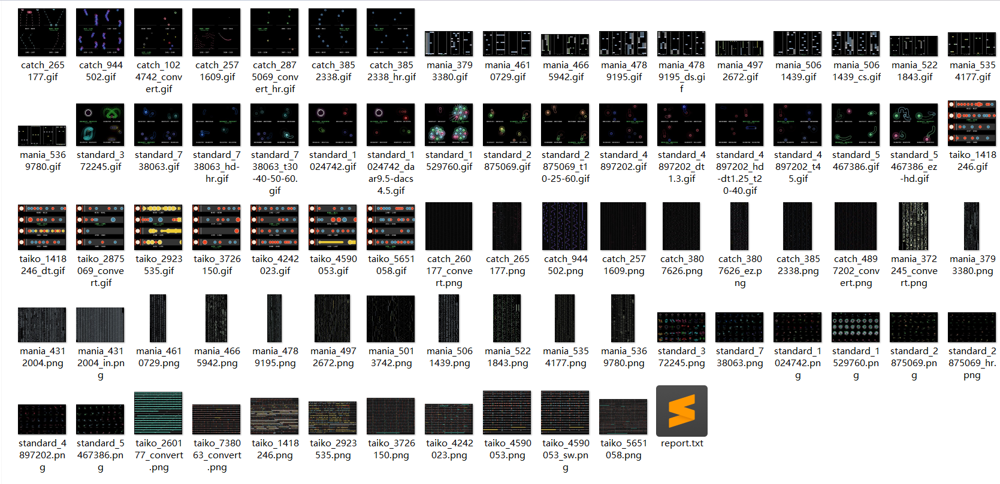

<div align="center">

# osu! Beatmap Preview

[](https://github.com/2710165659/osu-beatmap-preview/releases)
[](../LICENSE)
[](https://www.rust-lang.org/)
[](../crates/osu-beatmap-preview-web/README.md)
[](https://github.com/2710165659/osu-beatmap-preview/releases)

[](../README.md)
[](README.en.md)

</div>

A standalone osu! beatmap preview tool for osu!standard, osu!taiko, osu!catch, and osu!mania, with background video, hitsounds, and storyboard support. It exports PNG, GIF, and MP4 and supports real-time web preview.



## Highlights

- **Mods**: `EZ` `HR` `HD` `FL` `DA` `TC` `SW` `CS` `DS` `IN` `HO`, `1K`–`10K`, `DT`, `HT`, and more; some Mods accept a custom parameter.
- **Background video and storyboard**: supported by both MP4 export and the web preview, **disabled by default** and switchable via the settings.
- **Conversion**: Standard beatmaps convert to Taiko, Catch, or Mania, and Mods can be applied on top of the conversion.
- **Four modes**: osu!standard, osu!taiko, osu!catch, and osu!mania each have their own layout, skin, and colors, and each can export PNG overviews, segmented GIF previews, and H.264 MP4 videos with the original audio.
- **Real-time preview in the browser**: Unzip the web package and run `node backend/server.js` (or `npm start`) to play beatmaps in the browser with Mod hot-swapping, conversion, seek, speed, volume (default 50%), resolution (480P/720P/1080P) and 30/60/120 FPS switching, or jump straight in with `/?bid=<BID>`. The backend only downloads, caches, and reports download progress; every frame is rendered locally with WebGPU.
- **Fast and lightweight**: Frame rendering runs in configurable parallel chunks whose batch size is bounded by the per-frame byte count, keeping temporary memory peaks low on large canvases. GIF encoding reuses its frame buffer, Standard MP4 precomputes the visible objects per frame, and slider ticks and drum-roll ticks use procedural sprite caches. See the [batch rendering report](report.md) for measured numbers.
- **Standalone CLI with no external dependencies**: A single executable embeds skins, fonts, and the H.264 and AAC encoders, so no FFmpeg, extra shared libraries, or resource files are needed at runtime. Windows tries NVENC and AMF automatically and falls back to the built-in CPU encoder (`OSU_PREVIEW_NO_GPU=1` forces CPU). Download and output caches are reused locally, with a separate output directory per effective configuration.

See the [CLI guide](../crates/osu-beatmap-preview-cli/README.md) for the Mod syntax, every option, and the configuration reference.

## Documentation

The CLI is the main way to use the project, and its full documentation lives in the CLI README. This file only introduces the project and its architecture.

| Document | Content |
| --- | --- |
| [**CLI guide**](../crates/osu-beatmap-preview-cli/README.md) | Download, quick start, every command-line option, output formats, Mods, configuration, cache and logs |
| [Web site guide](../crates/osu-beatmap-preview-web/README.md) | Running the web package, backend routes, download and cache strategy |
| [WASM guide](../crates/osu-beatmap-preview-wasm/README.md) | Building the WASM bundle, JavaScript API, host responsibilities and limitations |
| [Architecture](architecture.md) | Crate split, API boundaries, scene and WGPU backend, non-goals |
| [Batch rendering report](report.md) | Performance and resource usage data |
| [Third-party notices](THIRD_PARTY_NOTICES.md) | Licenses and source offers for embedded codecs |

These guides are currently written in Chinese.

## Release artifacts

Two artifacts are published independently:

| Artifact | Form | Notes |
| --- | --- | --- |
| CLI | Single-file executable per platform | `osu-beatmap-preview-<platform>-<arch>-cli`, exports PNG/GIF/MP4 |
| Web package | `osu-beatmap-preview-web.zip` | Static site (real-time WebGPU rendering in the browser) plus a Node.js download backend |

See [Releases](https://github.com/2710165659/osu-beatmap-preview/releases). Neither artifact needs FFmpeg or extra resource files.

## Architecture

The code is split into a cross-platform core, a GPU rendering layer, and platform adapters. CPU export and real-time GPU rendering are two independent paths:

```text
CLI  -> cli layer -> arguments, config, download, cache, logs, media encoding, file output
                  `-> core: parsing, Mods, conversion, timeline, per-mode CPU frames and static scenes -> PNG/GIF/MP4

Web  -> Node backend downloads and caches .osz -> the browser hands the whole file to wasm
      -> wasm unpacks and decodes -> core RealtimeSession (rendering + music/hitsound mixing + clock) -> renderer WebGPU canvas
```

| Crate | Responsibility |
| --- | --- |
| `osu-beatmap-preview-core` | Beatmap model, parsing, Mods, conversion, timeline, and the per-mode CPU frame and static scene rendering that produces a `FrameScene` free of window, network, or audio device dependencies |
| `osu-beatmap-preview-renderer` | Platform-independent WGPU drawing; the host provides the device, queue, surface, and target view |
| `osu-beatmap-preview-cli` | Command-line arguments, config, download, cache, logs, timeline and layout assembly, media encoding, and file output (default build target, release artifact) |
| `osu-beatmap-preview-wasm` | Single-file input for the web: takes a `.osu` or `.osz` file, unpacks the archive and decodes music, background and hit sounds inside (zip / symphonia / image), and connects the core session and renderer to a browser WebGPU canvas. Exports `WebGpuSession` (rendering + clock + unified music/hitsound mixing) and `beatmapInfo` (beatmap info and difficulty list). Part of the web package |
| `osu-beatmap-preview-web` | Vue static site and Node.js download backend: downloads and caches `.osu`/`.osz` and serves the whole archive to the browser, where the wasm module unpacks and decodes it (release artifact, outside the Cargo workspace) |
| `osu-beatmap-preview-gui`, `osu-beatmap-preview-mobile` | Desktop and mobile skeletons for surface, input, playback lifecycle, and audio clock adapters |

The CLI always uses the CPU export path, does not depend on the renderer crate, and exposes no WGPU option. The real-time API reports an explicit error when the GPU is unavailable instead of silently falling back to CPU rendering. The web backend only downloads and caches; every frame is rendered by the wasm module inside the browser. See the [architecture document](architecture.md) for crate boundaries, configuration sources, and non-goals.

## Build from source

A stable Rust toolchain and a working C/C++ build environment are required; see <https://rustup.rs>.

```bash
git clone https://github.com/2710165659/osu-beatmap-preview.git
cd osu-beatmap-preview
cargo build --release
```

The only default workspace member is the CLI, so the output is `target/release/osu-beatmap-preview-cli` (`osu-beatmap-preview-cli.exe` on Windows).

Run the tests:

```bash
cargo test --workspace --all-features --all-targets
```

The web site runs on Node.js 18+, building its frontend needs Node.js 20.19+, and building its wasm bundle needs the Rust toolchain plus a `wasm-bindgen-cli` matching `Cargo.lock`:

```bash
cd crates/osu-beatmap-preview-web
npm install          # Vue / Vite / Tailwind, build-time only
npm run build        # compile src/ into dist/
npm run build:wasm   # writes public/pkg
npm test             # backend regression tests
npm start            # open http://127.0.0.1:8787
```

On Windows, `crates\osu-beatmap-preview-web\run_web.ps1` runs the whole sequence in one step: install dependencies → build wasm → build the frontend → start the server.

See the [web site guide](../crates/osu-beatmap-preview-web/README.md) and the [WASM guide](../crates/osu-beatmap-preview-wasm/README.md) for details.

To deploy the web service on a server, `Docker/Dockerfile-web` builds the wasm bundle, the frontend and the backend into a single image:

```bash
docker build -f Docker/Dockerfile-web -t osu-beatmap-preview-web .
docker run -d -p 8787:8787 -v osu-preview-cache:/data osu-beatmap-preview-web
```

## License

This project is licensed under the [MIT License](../LICENSE). The embedded AAC encoder uses Fraunhofer FDK-AAC, whose license grants no patent rights; see the [third-party notices](THIRD_PARTY_NOTICES.md).
